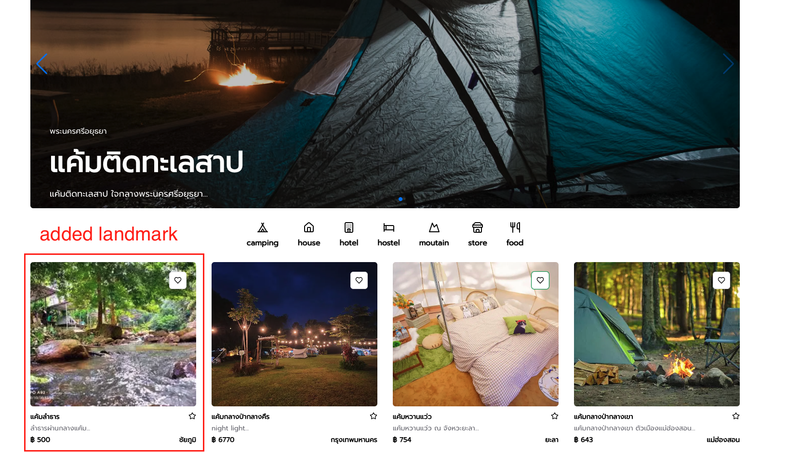
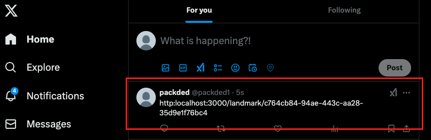

# TCamping - landmark blog project (Next JS)

## Introduction

This project is a blog website designed to store and share your favorite camping locations or any landmarks in Thailand . You can save your favorite spots and easily share them with friends.

The website is designed for users and does not require any admin management.

## Tool I used

- Authentication and Authorization: Implemented using Clerk
- Database: Supabase (hosted PostgreSQL database)
- ORM: Prisma for database modeling and queries
- UI Components: Utilizing Shadcn/UI library
- Mapping Visualization: Built with React Leaflet

## Feature

### Login - Register with clerk

- By using Clerk, users can register an account easily with their Gmail or Facebook credentials.

- All user data will be stored securely on the Clerk platform.

### Create Landmark

- Users are required to provide the name, description, price, image ,category, and province of the landmark. Additionally, they need to mark the location of the landmark on the map.

### Search

- Users can search by text, such as the name of a landmark or its province.
- Users can also search by the category of the landmark.
- Additionally, users can combine both text and category to perform a more specific search.

### Add favorited landmarks

- Users can mark landmarks as favorites, and these will be saved in the "Favorites" dropdown menu within their profile.

### Share to X

- Users can share their favorited landmarks on their X account, and the result will be a post containing a link to this website.But since the website is not yet deployed, the post will display a URL like "localhost:3000."

### Dark mode

- Users can toggle between dark mode and light mode

## Acknowledgment

This project could not have been completed without the guidance and support of **AJ Tam** and the valuable tutorials on his [รอยไถ พัฒนา](https://www.youtube.com/@roitai-dev)
