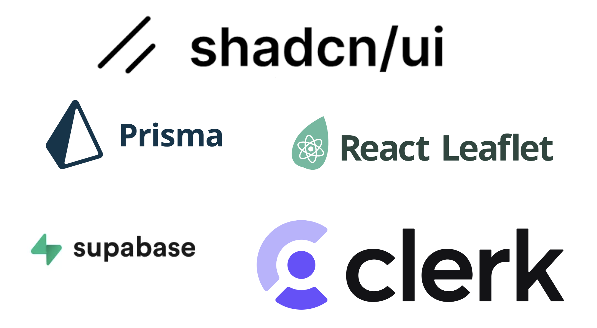
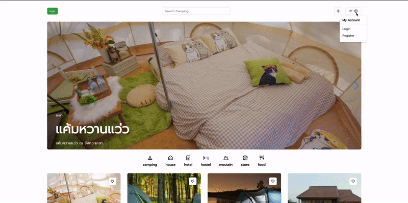
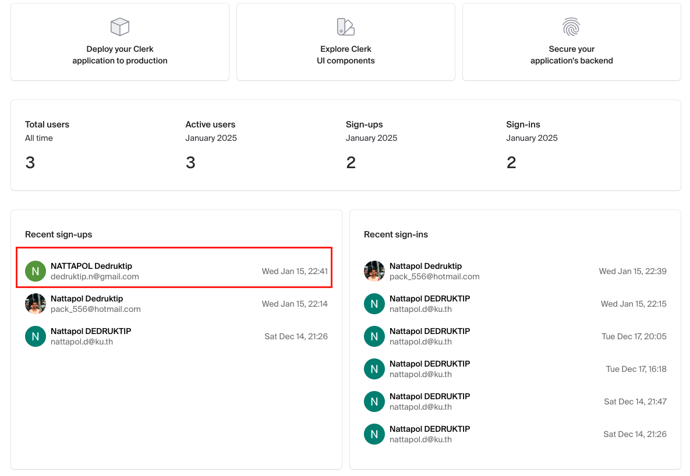

# TCamping - landmark blog project (Next JS)

## Introduction

This project is a blog website designed to store and share your favorite camping locations or any landmarks in Thailand . You can save your favorite spots and easily share them with friends.

The website is designed for users and does not require any admin management.

## Tool I used

- Authentication and Authorization: Implemented using Clerk
- Database: Supabase (hosted PostgreSQL database)
- ORM: Prisma for database modeling and queries
- UI Components: Utilizing Shadcn/UI library
- Mapping Visualization: Built with React Leaflet

## Feature

### Login - Register with clerk

- By using Clerk, users can register an account easily with their Gmail or Facebook credentials.

- All user data will be stored securely on the Clerk platform.

### Create Landmark

- Users are required to provide the name, description, price, category, and province of the landmark. Additionally, they need to mark the location of the landmark on the map.

### Search

### add favorite landmark

### share

### dark mode

## Acknowledgment

This project could not have been completed without the guidance and support of **AJ Tam** and the valuable tutorials on his [รอยไถ พัฒนา](https://www.youtube.com/@roitai-dev)
